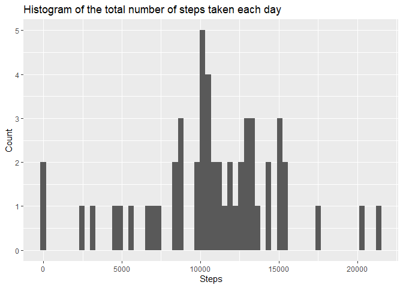
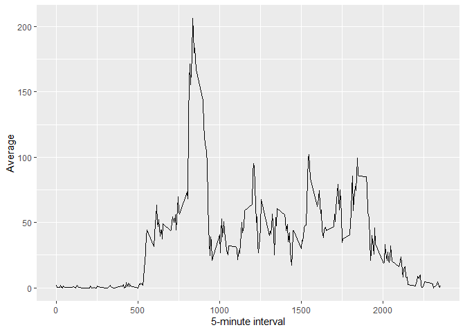
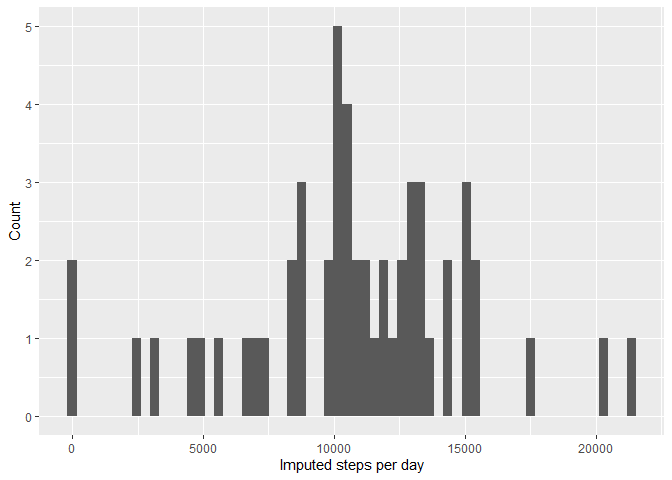
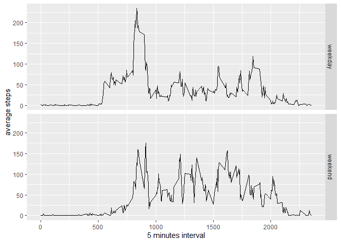

library(dplyr)

library(ggplot2)

<!-- Attaching package: ‘dplyr’ -->

<!-- The following objects are masked from ‘package:stats’: -->

<!--     filter, lag -->

<!-- The following objects are masked from ‘package:base’: -->

<!--     intersect, setdiff, setequal, union -->

<!-- Warning message: -->
<!-- package ‘dplyr’ was built under R version 4.0.2  -->


## Loading and preprocessing the data

#### Show any code that is needed to

#### 1.Load the data (i.e. read.csv())


```r
if(!file.exists('activity.csv')){
    unzip('activity.zip')
}
activityData <- read.csv('activity.csv')
summary(activityData)
```

```
##      steps            date              interval     
##  Min.   :  0.00   Length:17568       Min.   :   0.0  
##  1st Qu.:  0.00   Class :character   1st Qu.: 588.8  
##  Median :  0.00   Mode  :character   Median :1177.5  
##  Mean   : 37.38                      Mean   :1177.5  
##  3rd Qu.: 12.00                      3rd Qu.:1766.2  
##  Max.   :806.00                      Max.   :2355.0  
##  NA's   :2304
```

#### 2.Process/transform the data (if necessary) into a format suitable for your analysis


```r
activityData$date <- as.Date(activityData$date)
 activityData$weekend <- as.factor(ifelse(weekdays(activityData$date)=="Saturday" | weekdays(activityData$date)=="Sunday","weekend","weekday"))
    activityData$dayofweek <- as.factor(weekdays(activityData$date))
```
###### Intialize a variable and set Not NA 


```r
activityData_NotNA <- na.omit(activityData)
```

## What is mean total number of steps taken per day?

#### For this part of the assignment, you can ignore the missing values in the dataset.

#### 1.Calculate the total number of steps taken per day


```r
library(dplyr)
```

```
## Warning: package 'dplyr' was built under R version 4.0.2
```

```
## 
## Attaching package: 'dplyr'
```

```
## The following objects are masked from 'package:stats':
## 
##     filter, lag
```

```
## The following objects are masked from 'package:base':
## 
##     intersect, setdiff, setequal, union
```

```r
activityData_NotNADays <- group_by(activityData_NotNA, date)
activityData_NotNADays <- summarize(activityData_NotNADays, steps=sum(steps))
```

```
## `summarise()` ungrouping output (override with `.groups` argument)
```

```r
summary(activityData_NotNADays)
```

```
##       date                steps      
##  Min.   :2012-10-02   Min.   :   41  
##  1st Qu.:2012-10-16   1st Qu.: 8841  
##  Median :2012-10-29   Median :10765  
##  Mean   :2012-10-30   Mean   :10766  
##  3rd Qu.:2012-11-16   3rd Qu.:13294  
##  Max.   :2012-11-29   Max.   :21194
```

#### 2.If you do not understand the difference between a histogram and a barplot, research the difference between them. Make a histogram of the total number of steps taken each day


```r
library(dplyr)
library(ggplot2)
qplot(steps, data=activityData_NotNADays,binwidth=350,xlab='Steps', ylab='Count',main = 'Histogram of the total number of steps taken each day')
```

<!-- -->

#### 3. Calculate and report the mean and median of the total number of steps taken per day


```r
mean(activityData_NotNADays$steps)
```

```
## [1] 10766.19
```


```r
median(activityData_NotNADays$steps)
```

```
## [1] 10765
```

## What is the average daily activity pattern?

#### 1.Make a time series plot (i.e. \color{red}{\verb|type = "l"|}type = "l") of the 5-minute interval (x-axis) and the average number of steps taken, averaged across all days (y-axis)


```r
library(dplyr)
library(ggplot2)
activityDataaverages <- aggregate(x=list(steps=activityData_NotNA$steps), by=list(interval=activityData_NotNA$interval),
                      FUN=mean, na.rm=TRUE)

ggplot(data=activityDataaverages, aes(x=interval, y=steps)) +
    geom_line() +
    xlab("5-minute interval") +
    ylab("Average")
```

<!-- -->
#### 2.Which 5-minute interval, on average across all the days in the dataset, contains the maximum number of steps?

```r
activityDataaverages[which.max(activityDataaverages$steps),]
```

```
##     interval    steps
## 104      835 206.1698
```

## Imputing missing values
#### Note that there are a number of days/intervals where there are missing values (coded as \color{red}{\verb|NA|}NA). The presence of missing days may introduce bias into some calculations or summaries of the data.

#### 1.Calculate and report the total number of missing values in the dataset (i.e. the total number of rows with \color{red}{\verb|NA|}NAs)


```r
nrow(activityData)-nrow(activityData_NotNA)
```

```
## [1] 2304
```
#### 2. Devise a strategy for filling in all of the missing values in the dataset.

#### 3. Create a new dataset that is equal to the original dataset but with the missing data filled in.

```r
library(Hmisc)
```

```
## Warning: package 'Hmisc' was built under R version 4.0.2
```

```
## Loading required package: lattice
```

```
## Loading required package: survival
```

```
## Loading required package: Formula
```

```
## 
## Attaching package: 'Hmisc'
```

```
## The following objects are masked from 'package:dplyr':
## 
##     src, summarize
```

```
## The following objects are masked from 'package:base':
## 
##     format.pval, units
```

```r
activityDataImputed <- activityData_NotNA
activityDataImputed$steps <- impute(activityData_NotNA$steps, fun=mean)
```
#### 4.Make a histogram of the total number of steps taken each day and Calculate and report the mean and median total number of steps taken per day. Do these values differ from the estimates from the first part of the assignment? What is the impact of imputing missing data on the estimates of the total daily number of steps?

```r
library(dplyr)
library(ggplot2)

ActivityImputed <- tapply(activityDataImputed$steps, activityDataImputed$date, sum)
qplot(ActivityImputed, xlab='Imputed steps per day', ylab='Count', binwidth=350)
```

<!-- -->

```r
mean(ActivityImputed)
```

```
## [1] 10766.19
```


```r
median(ActivityImputed)
```

```
## [1] 10765
```

## Are there differences in activity patterns between weekdays and weekends?

#### For this part the \color{red}{\verb|weekdays()|}weekdays() function may be of some help here. Use the dataset with the filled-in missing values for this part.

#### 1.Create a new factor variable in the dataset with two levels – “weekday” and “weekend” indicating whether a given date is a weekday or weekend day.

```r
library(dplyr)
library(ggplot2)

  Avgsteps <- activityDataImputed %>% group_by(interval,weekend) %>%   summarise(average = mean(steps))
```

```
## `summarise()` regrouping output by 'interval' (override with `.groups` argument)
```

#### 2.Make a panel plot containing a time series plot (i.e. type=“l”) of the 5-minute interval (x-axis) and the average number of steps taken, averaged across all weekday days or weekend days (y-axis).


```r
library(dplyr)
library(ggplot2)


 qplot(interval,average,data=Avgsteps,geom="line",facets=weekend~.,xlab="5 minutes interval",ylab="average steps")
```

<!-- -->
        
